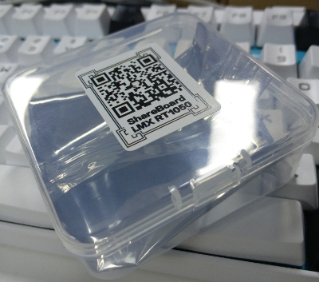
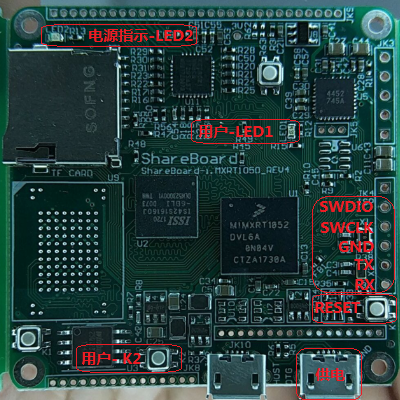
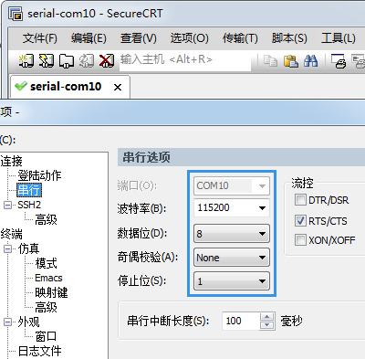
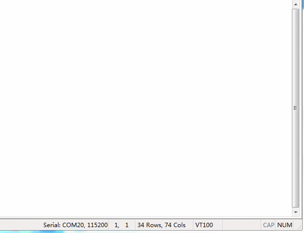
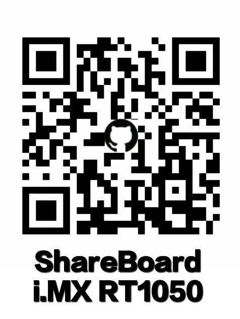

# 开箱教程
## 步骤1
- 请扫描包装盒上的二维码获取开箱教程及其它相关资源。    

- 包装盒内有备用的插针，需要使用插针的小伙伴可自行焊接:smile:

## 步骤2
- 请使用USB转TTL连接电脑与ShareBoard，仅需连接**GND, TXD, RXD**即可，如图所示：    
    


- 打开终端软件（如SecureCRT）连接对应的串口，参数为**115200/8/N/1**，如图所示：     


## 步骤3
- 连接上MicroUSB供电，此时电源指示**红色LED亮**。
- **请注意！因为A0芯片的bug，断电后再上电的时间间隔需大于5秒，否则无法正常启动（电源指示LED不亮）**

## 步骤4
- 如果一切正常，上电后终端软件将显示RTT的启动界面，当见到```“I am ShareBoard!”```之后，操作**按键K2**，终端将打印信息，同时**LED1**会随之ON/OFF
- **长按按键K2**将退出示例程序，进入MicroPython的交互模式，重新返回示例程序只需输入```f()```即可，如图所示：    
    

## To be continued...


## Reference
- [原理图](https://github.com/Share-Board/ShareBoard-iMXRT1050/blob/master/PCB/V0.40/ShareBoard-i.MXRT1050_REV4.pdf) 
- [RT-Thread+MicroPython+ShareBoard工程文件](https://github.com/Share-Board/ShareBoard-iMXRT1050/blob/master/Software/RT-Thread/MicroPython/RTT_MicroPython_ShareBoard.rar)
- [MicroPython GPIO映射](https://github.com/RT-Thread/rt-thread/blob/8ed3470d2a485c49ec4f5d4a5ec53e94edf7a2c8/bsp/imxrt1052-evk/drivers/drv_pin.c#L184)
- 


## NOTE!!
- **请注意！因为A0芯片的bug，断电后再上电的时间间隔需大于5秒，否则无法正常启动（电源指示LED不亮）**
- **请注意！因为A0芯片的bug，请不要连接调试口上的VCC（未焊接）**


